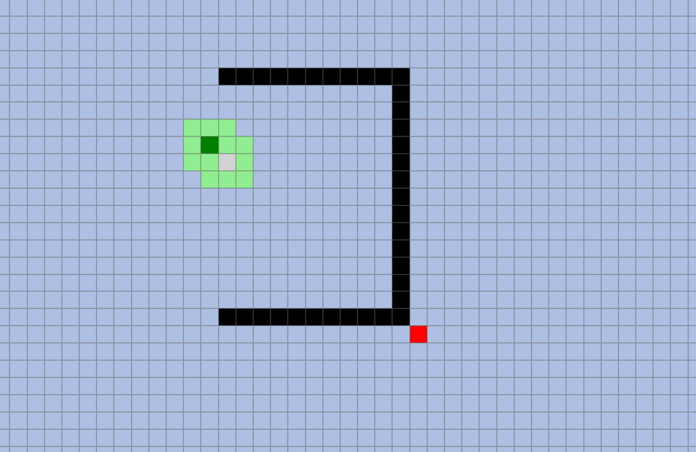
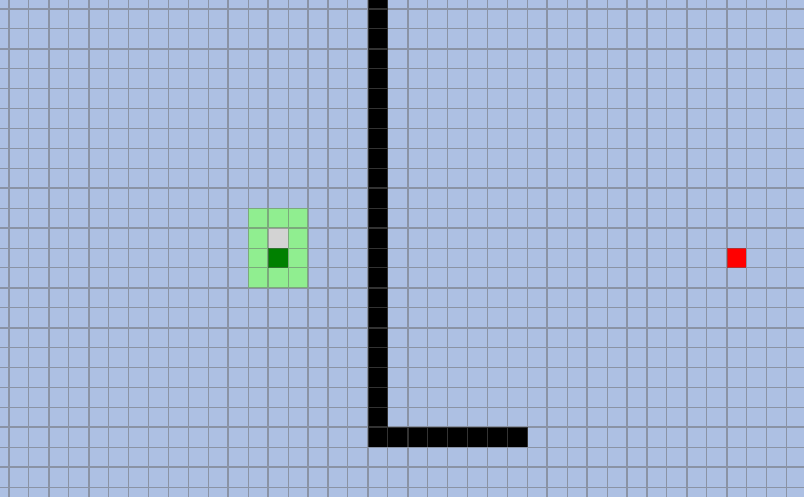
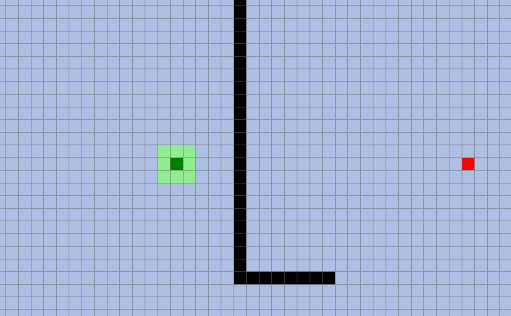
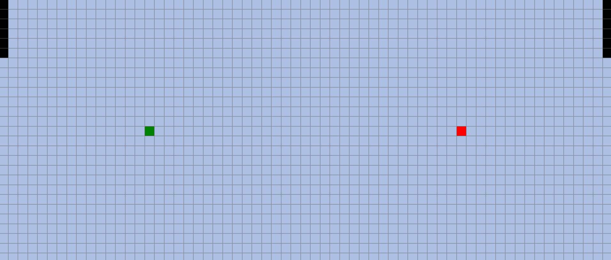
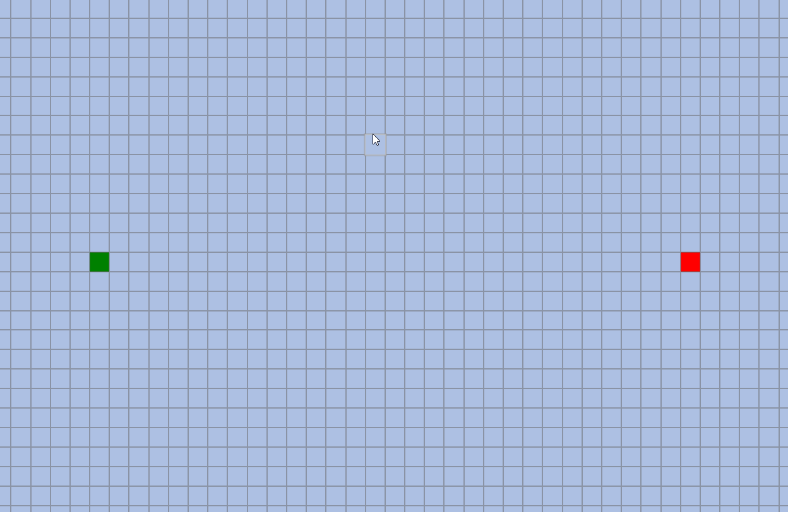
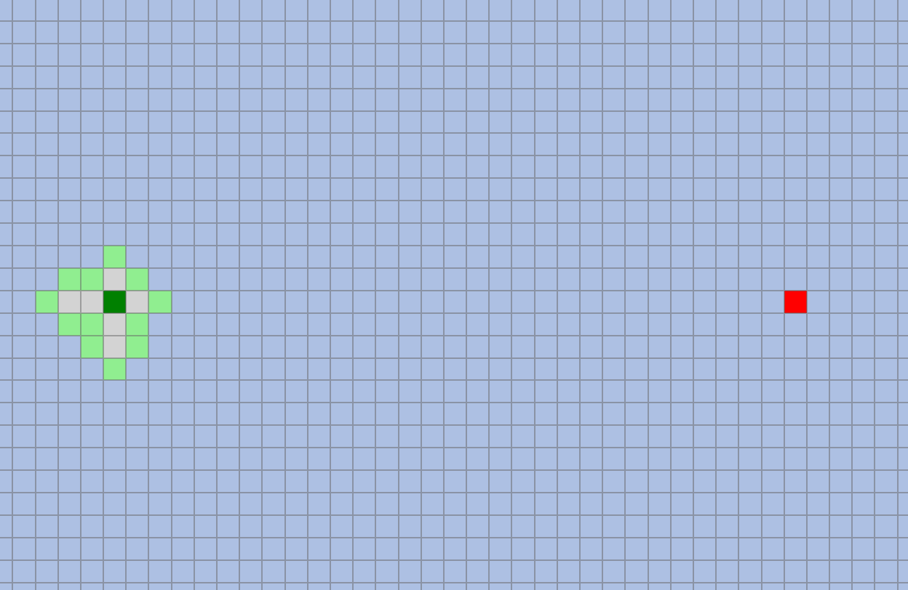

# Pathfinding Algorithms
The link to the website is **https://theraizer.github.io/PathFinding-Visualizer/**

The pathfinding algorithms included are:
- ## A*

- ## Dijkstra's

- ## Breadth-First Search

- ## Best First Search

### **The Maze Generation Algorithm is recursive division and can be seen below:**

### **If you like you can also manually create walls for the algorithms to work around:**

Due to the asynchronous functionality of the algorithm it is indeed possible to actively block the 
running pathfinding algorithm (to make the output path as accurate as possible you cannot draw over 
opened or closed cells):

